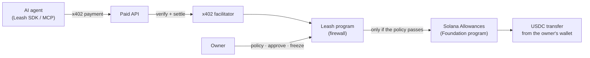

# Leash

**Spending limits and an off switch for AI agents, enforced on Solana.**

> Status: in development for the Superteam Germany Solana Challenge at WHU (Oct 2026). "Leash" is a working name.

## The problem

AI agents now pay for things on their own: Solana carried 23.2 million x402 agent payments in the four weeks to Sept 22, 2026, 76% of all of them. An agent does what the text in front of it says, so a crafted message can make it pay the wrong party. On May 4, 2026, a Morse-code post on X got Grok, wired to a trading bot, to send about $150–200k.

Today, giving an agent a wallet means giving it, and anyone who can manipulate it, the whole balance.

## What Leash does

Solana's official Allowances program (Solana Foundation, June 2026) lets you cap **how much** an agent can spend. Leash decides **who it may pay, how fast, and what happens when it's attacked**:

- **Allowlist:** the agent can only pay payees you approved.
- **Limits:** per payment, per payee, per period, and a rate limit.
- **Human in the loop:** payments above your threshold wait for one tap on your phone.
- **Tripwire:** when a manipulated agent keeps trying forbidden payments, it freezes itself, on-chain.
- **Off switch:** freeze one agent or all of them in one tap, from the web app, a Telegram alert or a Solana Action link.
- **Non-custodial:** your money never leaves your wallet. The most any agent can ever spend is the allowance you set in Solana's own audited program; Leash can only make that smaller.

## How it works



Leash payments are standard x402 payments. Any facilitator running the official `@x402/svm` package accepts them with a small configuration change: turn on smart-wallet verification and add the Leash program to its allowlist.

## Why Solana

- **Payments per API call** only make sense with sub-cent fees and sub-second settlement.
- **The firewall is on-chain,** where the money is. No prompt can change the rules, and a frozen agent is frozen for everyone from the next slot.
- **Composability:** Leash builds on the Foundation's audited Allowances program and the x402 standard instead of re-inventing custody and payments.

## Repository

| Path | What |
| --- | --- |
| [`docs/architecture/`](docs/architecture/00-overview.md) | System design, program spec, contracts, security model, conventions |
| [`docs/adr/`](docs/adr/README.md) | Architecture decisions |
| [`docs/workstreams/`](docs/workstreams/README.md) | How the build is split across parallel Claude Code sessions |
| `programs/leash/` | The on-chain program (Rust, Anchor) |
| `packages/` | Shared contracts, SDK, x402 layer, agent tools, MCP server |
| `services/` | Indexer, Sentinel (alerts), x402 facilitator |
| `apps/` | Web control panel, demo agent, demo merchants and attack lab |

Start with the [architecture overview](docs/architecture/00-overview.md).

## Run a local chain

Needs Node 22+, pnpm and the Solana toolchain (Agave CLI 4.x with `spl-token`). On Windows, run the chain inside WSL.

```bash
pnpm install
pnpm keys           # demo keypairs in .keys/ (never committed); prints their addresses
pnpm localnet       # solana-test-validator with both programs, mock USDC, funded demo keys
```

`pnpm localnet` loads `artifacts/programs/leash.so` and `subscriptions.so` (both checked against `artifacts/programs/CHECKSUMS`) at their real program IDs. It creates a mock USDC mint (6 decimals) that keeps its address across restarts, and gives the demo owner 1,000 USDC. Every address goes into `.localnet.json`. The chain listens on `http://127.0.0.1:8899`, keeps about a day of transaction history and starts empty each time; Ctrl+C stops it. After a restart, the indexer notices that its database followed the old chain (the RPC no longer knows its cursor), says so in its log, and starts over. From Windows: `wsl.exe -e bash -lc 'cd "/mnt/<drive>/<path>/hub" && bash scripts/localnet.sh'`.

For the devnet demo, `pnpm devnet:check` checks the Subscriptions program and the USDC mint, then prints each demo key's balances and what to fund from the faucets. It is read-only. `pnpm artifact:subscriptions` rebuilds `subscriptions.so` from the audited tag.
