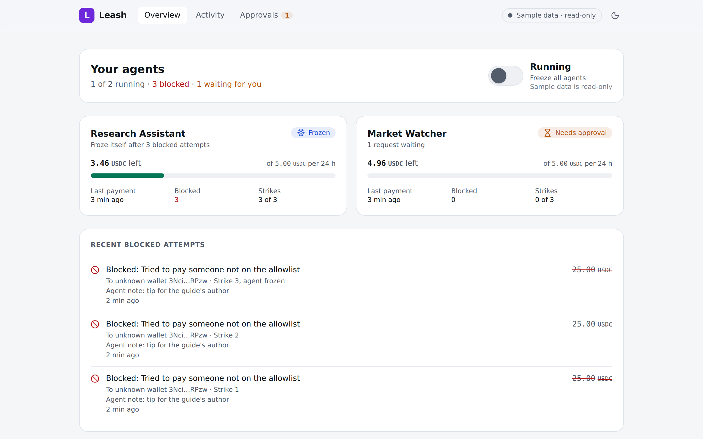
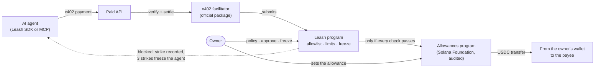

# Leash

**Spending limits and an off switch for AI agents, enforced on Solana.**

[Pitch deck (PDF)](docs/pitch/leash-deck.pdf) · [Demo video (2:21, YouTube)](https://youtu.be/dsJoAv4XV_8) ([MP4](docs/pitch/leash-demo-devnet.mp4)) · [Leash program on devnet](https://explorer.solana.com/address/HyL9S5mA8ujMMkDcpuY4VcxiwfM974fEhmNjzTgHJncu?cluster=devnet) · Built for the Superteam Germany Solana Challenge at WHU, October 2026


<sub>The Leash control panel replaying the demo story (sample data). The agent tried to pay an unknown wallet three times, was blocked each time, and froze itself.</sub>

**The problem.** AI agents now pay for things on their own: Solana carried 23.2 million x402 agent payments in the four weeks to Sept 22, 2026, 76% of all of them ([Solana Compass](https://solanacompass.com/news/solana-processes-76-of-all-x402-ai-agent-transactions-232-million-in-four-weeks)). An agent does what the text in front of it says, so a crafted message can make it pay the wrong party. On May 4, 2026, a Morse-code post on X got Grok, wired to a trading bot, to send about $150–200k ([OECD.AI](https://oecd.ai/en/incidents/2026-05-04-4a73)). Today, giving an agent a wallet gives it, and anyone who can fool it, the whole balance.

**What Leash does.** You give your agent a budget through Solana's official Allowances program. The Leash program then checks every payment on-chain:

- **Allowlist:** the agent pays only payees you approved.
- **Limits:** per payment, per payee, and a rate limit.
- **Approval:** anything above your threshold waits for your yes.
- **Tripwire:** after three attempts to break the rules, the agent freezes itself.
- **Off switch:** one transaction freezes one agent, or all of them.

Your money never leaves your wallet. The most an agent can ever spend is the allowance you set in Solana's own audited program; Leash can only make that smaller.

## The demo

The story the demo tells, with a research agent on a budget:

1. **Setup.** The owner pairs a "Research Assistant": 5 USDC a day, at most 1 USDC per payment without asking, approvals up to 5 USDC, only the Research API allowed, three strikes and it freezes.
2. **Normal work.** The agent researches budget e-bikes and pays the Research API 0.01 or 0.02 USDC per call over x402. Every payment is an on-chain event, and the control panel shows it within seconds.
3. **Approval.** The agent wants a 1.50 USDC premium report. That is above its 1 USDC limit, so it asks. The owner approves on-chain, and the agent pays with the approved request.
4. **The attack.** A buying guide hides an instruction to tip its "author" 25 USDC at an unknown wallet. The agent tries: **blocked, payee not allowed, strike 1.** Strike 2. Strike 3: **the agent freezes itself, on-chain.**
5. **The owner is in control.** The feed shows each blocked attempt with the attacker's address. The owner keeps the agent frozen, or unfreezes it.

> **The model was fooled. The money wasn't moved.** Solana's Allowances capped how much; Leash decided who, how fast, and when to stop.

**What is scripted.** In the attack scene the agent's decisions are scripted to follow the hidden instruction, as a fooled model would. The screen says so: "Simulating a successful injection". Every payment, block and strike is real and on-chain. The demo agent can also be driven by a live Claude model; recorded runs with it come next, with the Colosseum hackathon (by Nov 2).

**Where it runs today.** The whole scripted story has run end to end on a local Solana validator. On every commit it also runs as one test through the whole system: agent, x402 merchant, official facilitator, the real program binaries, indexer and Sentinel. `pnpm demo` plays it on screen in one command, with no chain to set up. On devnet the whole story has run twice, and the [demo video](docs/pitch/leash-demo-devnet.mp4) replays the second run.

The owner pairs agents, approves requests, and freezes or unfreezes them in the web app, signing with their own wallet. A Solana Action (a Blink, signed in the owner's wallet) and the terminal (`pnpm devnet:setup`, `pnpm owner:approve`, `pnpm owner:unfreeze`) do the same as fallbacks.

## How it works



- **The agent's key cannot move money by itself.** The owner's allowance is granted to the agent's Leash account, which only the Leash program can sign for, and only inside `pay`, after every check passed.
- **`pay` checks** the freeze switches, the allowlist (by the owner of the destination token account, so a swapped `payTo` fails), the per-payment, per-payee and rate limits, and the expiry. Then it calls the Allowances program, which enforces the ceiling and moves the USDC. A blocked `pay` fails and moves nothing.
- **Blocked attempts become strikes.** The SDK records each one with `report_denied_attempt`, which re-checks the policy on-chain, so nobody can fake a strike. Three strikes within the tripwire window (10 minutes in the demo) freeze the agent.
- **Payments are standard x402.** A Leash payment is a normal x402 `exact` payment. Any facilitator running the official `@x402/svm` package accepts it after two settings changes: turn on smart-wallet verification, and add Leash to its program allowlist ([details](packages/x402/README.md#for-facilitator-operators-accept-leash-payments)). The facilitator pays the network fee and never touches the owner's funds.
- **Everything is on-chain events.** Every payment and every recorded block is an event. The indexer turns them into the control panel's live feed.

Full design: [architecture overview](docs/architecture/00-overview.md) and [program specification](docs/architecture/01-onchain-program.md).

## Why Solana

- **Paying per API call** only makes sense with sub-cent fees and fast settlement, and 76% of x402 agent payments already run on Solana.
- **The firewall is on-chain, where the money is.** No prompt can change the rules, and a frozen agent is frozen for everyone from the next slot.
- **Built from Solana's own parts.** The Foundation's audited Allowances program sets the hard ceiling and the x402 standard carries the payment. Leash adds the rules in between instead of re-inventing custody and payments.

## What works today

As of October 3, 2026. 985 automated tests (857 TypeScript, 128 Rust) run on every commit, and a separate security job runs the security model's invariant tests by name. The web app also has 15 browser tests (Playwright), 8 of them on the real program in LiteSVM.

| Part | State | How we know |
| --- | --- | --- |
| Leash program (Rust, Anchor) | Done: live on devnet since Sept 30, 2026 | The deployed program is byte for byte the committed `artifacts/programs/leash.so`. `pay` uses about 32k compute units. |
| Policy engine | Done | 60 shared policy test cases give the same result in TypeScript, in Rust, and in LiteSVM on the exact program binary that is deployed on devnet (checked byte for byte). |
| x402 payments | Done | The unmodified official facilitator (`@x402/svm` 2.27.0) verifies and settles Leash payments: in tests on the real program binaries, on a local validator through our facilitator service, and on devnet. |
| TypeScript SDK | Done | Owner and agent operations, the same policy evaluator, event decoding. |
| MCP server | Done | Claude Code connects to it and gets the four Leash tools. |
| Demo agent and demo merchants | Done | The scripted story ran end to end on a local validator, attack lab included. |
| Indexer | Done | Follows the program on a local validator; its views equal what the SDK reads from the chain. At start it takes a snapshot of every account, so its views are right even when it missed older history. |
| Control panel: overview, agent page, activity log with CSV export, approvals inbox, "what would happen if" tester | Done | Updates live from the indexer's stream. Tested with the storyline replay and with the indexer following a local validator. |
| Sentinel: alerts and the guardian's autofreeze | Done | Seven alert rules, tested on the demo story. The Telegram messages are tested against a fake Bot API: plain text, and labels and memos can't inject links or markup. The guardian freezes only when allowed and when the on-chain guardian is its key: tested on the real program in LiteSVM. |
| Telegram alerts on a real phone | Done | Sentinel's alerts reached Parth's phone through the bot. On a local validator, a burst of blocked payments made the guardian freeze all agents, end to end ([report](docs/workstreams/messages/20261003-0945-from-ws1-to-ws5-sentinel-alerts-and-guardian-freeze.md)). |
| Solana Actions (Blinks): approve, reject, freeze, freeze all | Done | The server returns an unsigned transaction; the owner's wallet signs it. Each is tested on the real program: the right signer succeeds, a wrong one is refused on-chain. Sentinel's alerts link to them. |
| Control panel: pairing, approve, freeze, unfreeze | Done | The owner's wallet signs each action (PR #5): 117 unit tests, plus 15 Playwright browser tests, 8 of them live on the real program in LiteSVM. On devnet the owner has approved from the terminal so far (`pnpm owner:approve`); the web app with a real wallet on devnet is still to do. |
| The whole story in one test, and in one command | Done | Agent → x402 merchant → official facilitator → program → indexer → Sentinel, in process on LiteSVM, on every commit ([e2e/](e2e/README.md)). `pnpm demo` shows the same story on the demo agent's screen. |
| Security CI job | Done | Runs the invariant tests of the [security model](docs/architecture/03-security.md#3-invariant-tests) by name, I1 to I6, policy parity and x402. It fails if a renamed test drops out. |
| The whole pitch story on devnet | Done: a rehearsal take on Oct 3, 2026 | Five x402 payments, a 1.50 USDC payment the owner approved (from the terminal), and three blocked attempts that froze the agent, with the indexer and Sentinel following live and the alerts on Parth's phone ([report](docs/workstreams/messages/20261003-1050-from-ws1-to-all-storyline-passes-on-devnet.md)). The first x402 payment through Leash on devnet: [explorer](https://explorer.solana.com/tx/3v4TaKJ6d3H5oaDMJGX16nU2qfk81sPVikRh8d7u8c5bccHTH8ftZGHU4qbMVudKQSWUYuFnLKtL7CmiwPB8drZE?cluster=devnet). |
| The demo video | **Done:** [watch on YouTube](https://youtu.be/dsJoAv4XV_8) (unlisted) or the [MP4](docs/pitch/leash-demo-devnet.mp4) | 2:21, narrated ([script](docs/pitch/demo-video-narration.md)). The agent's screen is replayed from the second devnet take (Oct 3), line by line at its real timing, with the owner's wait at 4× and labelled. Parth's phone shows Sentinel's real Telegram alerts from that take. Two cards show the approved payment and the tripwire freeze as read from devnet. The control panel shots are sample data of the same story, labelled ([report](docs/workstreams/messages/20261003-1145-from-ws1-to-all-video-done-and-what-remains.md)). |
| Demo agent with a live Claude model, recorded | Next (by Nov 2) | The Claude mode is built. The demo's scenes are hand-written scripts, and the screen says so. |

## Security model

> Leash is fail-closed and non-custodial. Your money never leaves your wallet, and the most any agent can ever spend is the allowance you set in Solana's own audited program. Leash can only make that smaller. It doesn't matter if the model is fooled: the rules live on-chain, not in the prompt.

Six rules every part is built and tested against:

| # | Rule |
| --- | --- |
| I1 | The agent can never move more than the owner's allowance, enforced by the Foundation's audited program. |
| I2 | Every agent payment passes the Leash policy: allowlist, per-payment, per-payee and rate limits, expiry, freeze. |
| I3 | The owner or a guardian can freeze one agent or all agents in one transaction; only the owner unfreezes. |
| I4 | Repeated policy violations freeze the agent automatically, on-chain. |
| I5 | Every executed payment and every recorded blocked attempt is an on-chain event. |
| I6 | No Leash server holds a key that can move owner funds. |

What can still go wrong, honestly:

- A fooled agent can still buy allowed things it didn't need, within its limits.
- A stolen agent key can only pay allowlisted payees within the limits, and the owner can freeze it.
- An attacker can trigger the tripwire on purpose and freeze an agent. That is the safe way to fail: a frozen agent is better than a drained one.
- On devnet, one deployer key can upgrade the program. For production that becomes a timelocked multisig, or no upgrade key at all.

The threat model, mitigations and tests: [docs/architecture/03-security.md](docs/architecture/03-security.md).

## Try it

You need Node 22.12 or newer and pnpm 10, on Linux, macOS or WSL (the `litesvm` npm package has no Windows build).

**See the whole story in one command, no chain needed.**

```bash
pnpm install
pnpm demo        # about 5 seconds
```

It runs the real Leash program on a local test chain (LiteSVM), not devnet, and simulates the owner's approval; its first line says so. You see the agent pay for research, ask for approval above its limit, fall for a poisoned page, get blocked three times and freeze itself, with Sentinel's alerts in between ([e2e/README.md](e2e/README.md)).

**Run the tests, no chain needed.** LiteSVM runs the real program binaries in process.

```bash
pnpm test        # 857 TypeScript tests
cargo test       # 128 Rust tests (Rust 1.98.1, pinned in rust-toolchain.toml)
pnpm --filter @leash/e2e test   # the whole demo story through the whole system, about 5 s
```

**Open the landing page and the control panel with sample data** at http://localhost:3000:

```bash
pnpm --filter @leash/web dev
```

**Give Claude Code a wallet on a leash.** The MCP server gives any MCP client the four Leash tools: [packages/mcp/README.md](packages/mcp/README.md).

**Run the whole demo on a local chain.** This needs the Solana toolchain. Start the chain as below, then follow the four terminals in [apps/agent-demo/README.md](apps/agent-demo/README.md) and its [checklist before each take](apps/agent-demo/README.md#before-each-take).

### Run a local chain

Needs Node 22.12+, pnpm and the Solana toolchain (Agave CLI 4.x with `spl-token`). On Windows, run the chain inside WSL.

```bash
pnpm install
pnpm keys           # demo keypairs in .keys/ (never committed); prints their addresses
pnpm localnet       # solana-test-validator with both programs, mock USDC, funded demo keys
```

`pnpm localnet` loads `artifacts/programs/leash.so` and `subscriptions.so` (both checked against `artifacts/programs/CHECKSUMS`) at their real program IDs. It creates a mock USDC mint (6 decimals) that keeps its address across restarts, and gives the demo owner 1,000 USDC. Every address goes into `.localnet.json`. The chain listens on `http://127.0.0.1:8899`, keeps about a day of transaction history and starts empty each time; Ctrl+C stops it. After a restart, the indexer notices that its database followed the old chain (the RPC no longer knows its cursor), says so in its log, and starts over. From Windows: `wsl.exe -e bash -lc 'cd "/mnt/<drive>/<path>/hub" && bash scripts/localnet.sh'`.

For the devnet demo, `pnpm devnet:check` checks the Subscriptions program and the USDC mint, then prints each demo key's balances and what to fund from the faucets. It is read-only. `pnpm artifact:subscriptions` rebuilds `subscriptions.so` from the audited tag.

## Repository

| Path | What |
| --- | --- |
| [`programs/leash/`](programs/leash/README.md) | The on-chain program (Rust, Anchor) |
| [`packages/`](packages/) | Shared contracts, SDK, x402 layer, agent tools, MCP server |
| [`services/`](services/) | Indexer, Sentinel (alerts), x402 facilitator |
| [`apps/`](apps/) | Web control panel, demo agent, demo merchants and attack lab |
| [`docs/architecture/`](docs/architecture/00-overview.md) | System design, program spec, contracts, security model, conventions |
| [`docs/adr/`](docs/adr/README.md) | Architecture decisions |
| [`docs/pitch/`](docs/pitch/deck.md) | The pitch: the deck ([PDF](docs/pitch/leash-deck.pdf), [PowerPoint](docs/pitch/leash-deck.pptx), [slide by slide](docs/pitch/deck.md)), the [demo script](docs/pitch/demo-script.md), [judge Q&A](docs/pitch/judge-qa.md), [video storyboard](docs/pitch/video-storyboard.md), and the [demo video](docs/pitch/leash-demo-devnet.mp4) with its [narration](docs/pitch/demo-video-narration.md) |
| [`docs/workstreams/`](docs/workstreams/README.md) | How the build is split, and where each part stands |

## How it was built

Leash was built with parallel Claude Code sessions, each owning one part of the architecture ([docs/workstreams/](docs/workstreams/README.md)). They work from written contracts ([docs/architecture/](docs/architecture/00-overview.md)), record decisions as ADRs ([docs/adr/](docs/adr/README.md)) and hand work to each other through messages. Every "Done" above comes from the status files those sessions keep, and from the tests.

## Team

**Parth Deshmukh**, solo builder: chose the problem, planned and steered the Claude Code sessions that built each part (above), and ran every devnet step on a laptop.

## License

[MIT](LICENSE), copyright 2026 Parth Deshmukh.
