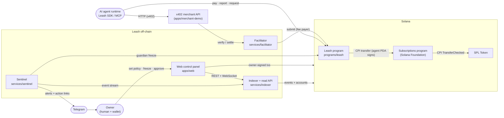
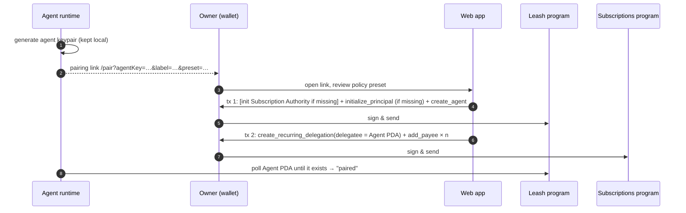
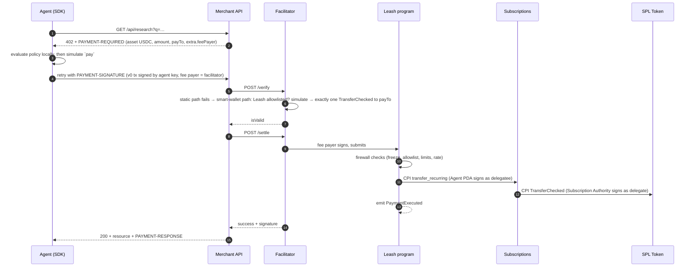
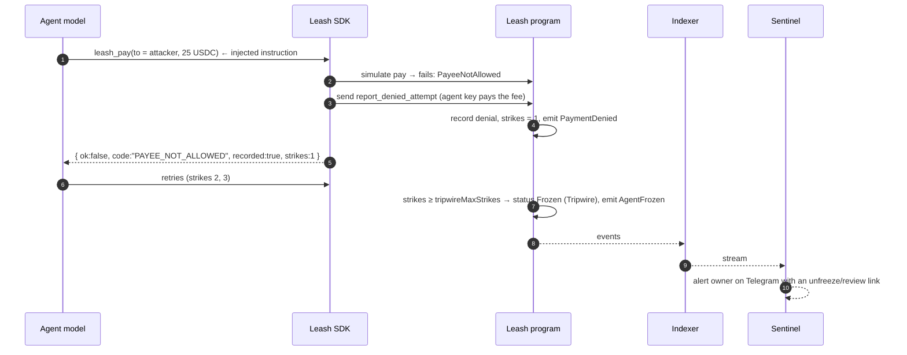

# Leash: architecture overview

> **Leash** is the working name. Renaming is a single global search-and-replace, done before the pitch if at all (checklist in [04-conventions.md](04-conventions.md#9-renaming)).
>
> Read this document first. It defines the vocabulary every other document uses.

## 1. What we are building

**Leash is a spending firewall for AI agents on Solana.**

The owner gives an agent a budget through Solana's official **Allowances** program (the Solana Foundation's audited *Subscriptions & Allowances* program, June 2026). Leash sits between the agent and that budget, and decides on-chain whether each payment may go through:

- only to **allowlisted payees**,
- within **per-payment**, **per-payee** and **rate** limits,
- never while the agent (or the whole account) is **frozen**,
- with **human approval** above a threshold.

When a manipulated agent tries something the policy forbids, the attempt is recorded on-chain as a **strike**. After repeated strikes the agent **freezes itself** (the **tripwire**). The owner, or a guardian, can freeze any agent with one tap. The owner's money never leaves the owner's wallet.

**Who it is for:** developers and small teams whose AI agents pay for things (x402 paid APIs, services, purchases). Today they hand an agent a raw private key or a custodial wallet, which gives the agent, and anyone who can manipulate it, the whole balance.

**Why now:** agents already pay on their own. Solana carried 23.2 million x402 agent payments in the four weeks to Sept 22, 2026, 76% of all of them. And a manipulated agent pays the attacker: on May 4, 2026 a Morse-code message on X got Grok, wired to the Bankr bot, to send about $150–200k. Sources are in [docs/context/transcript.md](../context/transcript.md#attachment-idea-book).

**Positioning in one sentence:** *Solana's Allowances decide how much an agent may spend. Leash decides who it may pay, how fast, and what happens when it is attacked.*

## 2. Product invariants

Every workstream designs, tests and demos against these six rules. If a change would weaken one, it needs an ADR.

| # | Invariant | Enforced by |
| --- | --- | --- |
| **I1** | **Hard ceiling.** An agent can never move more than the allowance the owner granted in the Subscriptions program. | The Foundation's audited Subscriptions program (independent of Leash code) |
| **I2** | **Firewall.** Every agent payment passes Leash policy: allowlist, per-payment limit, per-payee limits, rate limit, expiry, freeze. There is no other path from the owner's funds to anyone the agent chooses. | Leash program |
| **I3** | **Off switch.** The owner or the guardian can freeze one agent or all agents in one transaction, effective from the next slot. Only the owner can unfreeze. | Leash program |
| **I4** | **Tripwire.** Repeated policy violations freeze the agent automatically, on-chain. | Leash program (`report_denied_attempt`) + SDK |
| **I5** | **Audit.** Every executed payment and every reported blocked attempt is an on-chain event with amount, payee, reason and purpose. | Leash program events → indexer |
| **I6** | **Non-custodial.** No Leash server holds a key that can move owner funds. Servers hold at most a guardian key (can only freeze) and a facilitator fee-payer key (pays SOL network fees only). | Architecture + key management |

## 3. System context



## 4. Components

| Component | Path | Workstream | Responsibility |
| --- | --- | --- | --- |
| Leash program | `programs/leash` | WS1 | On-chain firewall: principals, agents, payees, payment requests, policy evaluation, CPI into Subscriptions, events. **The primary contract.** |
| Shared contracts | `packages/contracts` | WS0 (shared) | Constants, cluster config, domain enums, zod schemas for every off-chain interface, fixtures, policy test vectors, the committed IDL. |
| SDK | `packages/sdk` | WS2 | Typed client (Codama-generated + ergonomic layer), owner and agent operations, TypeScript policy evaluator, event decoding, Subscriptions integration. |
| x402 layer | `packages/x402` | WS3 | Agent-side `leashFetch`, merchant-side helpers, facilitator configuration. |
| Facilitator | `services/facilitator` | WS3 | x402 v2 facilitator built on the official `@x402/svm` scheme with smart-wallet verification and Leash on the program allowlist. |
| Indexer | `services/indexer` | WS4 | Ingests Leash (and Subscriptions) events, keeps projections, serves REST and a WebSocket stream. Single writer of the database. |
| Sentinel | `services/sentinel` | WS5 | Off-chain anomaly rules, guardian freeze, Telegram alerts with action links. |
| Web control panel | `apps/web` | WS6 | Owner UX: onboarding and pairing, policy and allowlist editing, live activity, approvals, freeze, Solana Actions (Blinks), landing page. |
| Agent tools | `packages/tools` | WS7 | The four Leash tools (02 §8) for any agent framework. |
| MCP server | `packages/mcp` | WS7 | Exposes the Leash tools to any MCP client (Claude Desktop, Claude Code, Cursor). |
| Demo agent | `apps/agent-demo` | WS7 | Claude-powered agent plus a deterministic scenario runner for the pitch. |
| Demo merchants | `apps/merchant-demo` | WS8 | Legit x402 APIs and an adversarial lab (prompt injection, attacker payee, overpricing). |
| Platform | root configs, `scripts/`, `.github/` | WS0 | Monorepo, tooling, CI, environments, deploy and seed scripts. |
| Integration and story | `e2e/`, `README.md`, `docs/pitch/` | WS9 | End-to-end acceptance suite, README, demo script, deck content. |

External dependencies:

| Dependency | Address / package | Notes |
| --- | --- | --- |
| Subscriptions program | `De1egAFMkMWZSN5rYXRj9CAdheBamobVNubTsi9avR44` | Foundation program, Pinocchio, audited. Client: `@solana/subscriptions` (Kit plugin). Source: github.com/solana-foundation/subscriptions |
| SPL Token / Token-2022 | standard | USDC is a classic SPL Token mint. |
| USDC (devnet) | `4zMMC9srt5Ri5X14GAgXhaHii3GnPAEERYPJgZJDncDU` | Circle devnet USDC. WS0 verifies the address before use. On localnet we mint a mock USDC (6 decimals). |
| x402 | `@x402/core`, `@x402/svm`, `@x402/hono`, `@x402/fetch` (v2) | Official packages. The facilitator uses `ExactSvmScheme` with `enableSmartWalletVerification`. |
| Claude API | `@anthropic-ai/sdk` | Demo agent only. |

## 5. Key flows

### 5.1 Onboarding and pairing an agent

The agent runtime generates its own keypair and never shares the secret. The owner only ever sees the agent's **public** key.



The exact transaction grouping is owned by the SDK (WS2) and depends on transaction size.

### 5.2 Paying an x402 merchant (happy path)



The payment transaction is `[SetComputeUnitLimit, SetComputeUnitPrice, leash::pay, Memo]`. The facilitator skips ComputeBudget and Memo when it checks the allowlist, so only Leash has to be allowlisted.

### 5.3 A manipulated agent is stopped (blocked attempt and tripwire)



`pay` never succeeds without moving money. A blocked `pay` fails and moves nothing. The on-chain record of the attempt comes from the separate `report_denied_attempt` instruction ([ADR-0002](../adr/0002-strict-pay-and-reported-denials.md)).

### 5.4 Off switch

- **Freeze one agent:** `freeze_agent` (owner or guardian signs). Every later `pay` fails with `AgentFrozen`.
- **Freeze everything:** `freeze_principal` (owner or guardian). Every agent of this owner stops.
- **Hard stop, belt and braces:** the owner revokes the Subscriptions delegation (or the whole Subscription Authority). Even a bug in Leash could then not move funds.
- **Unfreeze:** owner only (`unfreeze_agent` / `unfreeze_principal`). Unfreezing an agent resets its strikes.

Entry points: web app (one tap), Solana Action (Blink) link, Telegram alert link, Sentinel (guardian key, automatic).

### 5.5 Human approval for a large payment

1. The agent needs to pay more than `maxPerPayment` but no more than `maxPerRequest`. The SDK calls `request_payment`, which creates a `PaymentRequest` account and emits `PaymentRequested`.
2. Sentinel notifies the owner, who approves in the web app or through the approval Action link (`approve_request`).
3. The agent calls `pay` with the approved request attached. The instant limit is waived for exactly that payee, amount and reference, and the request is consumed. Freeze, allowlist, rate limit and the allowance ceiling (I1) still apply.

This keeps x402 intact: the approved payment is still the agent's x402 payment transaction.

## 6. Keys, roles and trust boundaries

| Key | Held by | Can | Cannot |
| --- | --- | --- | --- |
| Owner wallet | Human (Phantom, Solflare, Backpack) | Everything: policy, payees, approvals, freeze and unfreeze, delegations, withdrawals | n/a |
| Agent key | Agent runtime (local file or env) | Call `pay`, `request_payment`, `report_denied_attempt` for its own Agent account | Change policy, unfreeze, pay non-allowlisted payees, exceed limits or the allowance |
| Agent PDA | Leash program | Sign the Subscriptions transfer, only inside `pay` after the policy passed | Anything outside `pay` |
| Guardian key | Sentinel service (optional, per principal) | `freeze_agent`, `freeze_principal`, `reject_request` | Unfreeze, move funds, change policy |
| Facilitator fee payer | Facilitator service | Pay SOL fees for x402 settlements | Appear in any instruction's accounts (x402 fee-payer isolation) |
| Program upgrade authority | Deployer (devnet); timelocked multisig or revoked (production) | Upgrade Leash | Documented in [03-security.md](03-security.md) |

The web app and the indexer are **convenience layers**. Before the owner signs anything security-relevant, the web app re-reads the accounts it depends on from the chain rather than trusting indexer data.

## 7. Environments

| Mode | Chain | Used for |
| --- | --- | --- |
| `localnet` | Surfpool or `solana-test-validator` with the Leash and Subscriptions programs loaded and a mock USDC mint | Local development and integration tests |
| `devnet` | Solana devnet, real Subscriptions deployment (WS0 verifies it; fallback: our own deployment of the audited source) | Demo and pitch |
| in-process | LiteSVM with `artifacts/programs/*.so` | Fast program, SDK and facilitator tests (no RPC needed) |

**Cloud Claude Code sessions** (Claude Code on the web) can reach npm, PyPI and crates.io, but not Solana RPC endpoints, the Solana/Anchor installers or GitHub release downloads. Consequences:

- TypeScript work, host-side Rust unit tests and LiteSVM tests (using committed `.so` artifacts) run in the cloud.
- Building the SBF program, deploying and anything that needs devnet run on a machine with the Solana toolchain and network access (or in a cloud environment whose network policy allows those hosts; see [ADR-0007](../adr/0007-environments-and-artifacts.md)).

## 8. Repository map

```text
.
├── CLAUDE.md                 rules for every Claude session (read first)
├── README.md                 product README (pitch-facing)
├── Anchor.toml, Cargo.toml   Anchor workspace (WS1)
├── package.json, pnpm-workspace.yaml, turbo.json, biome.json, tsconfig.base.json (WS0)
├── programs/leash/           on-chain program (WS1)
├── artifacts/programs/       committed leash.so and subscriptions.so for LiteSVM (WS1, WS0)
├── packages/
│   ├── contracts/            shared types, schemas, config, fixtures, test vectors, IDL (WS0, shared)
│   ├── sdk/                  @leash/sdk (WS2)
│   ├── x402/                 @leash/x402 (WS3)
│   ├── tools/                @leash/tools (WS7)
│   └── mcp/                  @leash/mcp (WS7)
├── services/
│   ├── indexer/              (WS4)
│   ├── sentinel/             (WS5)
│   └── facilitator/          (WS3)
├── apps/
│   ├── web/                  (WS6)
│   ├── agent-demo/           (WS7)
│   └── merchant-demo/        (WS8)
├── scripts/                  localnet, deploy, seed (WS0)
├── e2e/                      end-to-end acceptance suite (WS9)
└── docs/
    ├── architecture/         this folder
    ├── adr/                  decisions (one file each)
    ├── workstreams/          one brief per Claude session + status files
    ├── context/              founding conversation transcript
    └── pitch/                demo script, deck content (WS9)
```

## 9. Document map

| Document | Contents |
| --- | --- |
| [01-onchain-program.md](01-onchain-program.md) | Leash program: accounts, seeds, instructions, evaluation order, errors, events, CPI. The primary contract. |
| [02-contracts.md](02-contracts.md) | Off-chain contracts: config, domain types, indexer API, x402 profile, agent tools, Actions, environment variables. |
| [03-security.md](03-security.md) | Threat model, mitigations, invariant tests. |
| [04-conventions.md](04-conventions.md) | Code standards, naming, units, errors, logging, testing, git workflow. |
| [../adr/](../adr/) | Architecture decisions and contract changes. |
| [../workstreams/README.md](../workstreams/README.md) | How the work is split across Claude sessions. |

## 10. Glossary

| Term | Meaning |
| --- | --- |
| **Owner** | The human who funds and controls agents. Their wallet signs all admin actions. |
| **Principal** | The owner's Leash account (PDA). Holds the guardian and the global freeze flag. |
| **Agent** | The Leash account (PDA) for one AI agent: its signing key, policy, status and counters. The Agent PDA is also the Subscriptions delegatee. |
| **Agent key** | The keypair the agent runtime signs with. Holds no funds and no authority except calling `pay`, `request_payment` and `report_denied_attempt` on its own Agent account. |
| **Allowance** | A Subscriptions delegation (recurring or fixed) from the owner to the Agent PDA. The hard ceiling (I1). |
| **Payee** | An allowlist entry: a wallet the agent may pay, with optional per-payee limits. |
| **Policy** | The agent's limits: `maxPerPayment`, `maxPerRequest`, `payeeMode`, rate limit, tripwire, expiry. |
| **Denial** | A payment the policy blocks, with a `DenialReason`. |
| **Strike** | A denial whose reason signals manipulation or a bug (for example, paying a non-allowlisted payee). |
| **Tripwire** | Automatic freeze after `tripwireMaxStrikes` strikes within `tripwireWindowSecs`. |
| **Guardian** | Optional freeze-only key per principal, usually held by Sentinel. |
| **Payment request** | An agent's on-chain ask for owner approval of a payment above its instant limit. |
| **Facilitator** | x402 service that verifies and settles payments and pays the network fee. |
