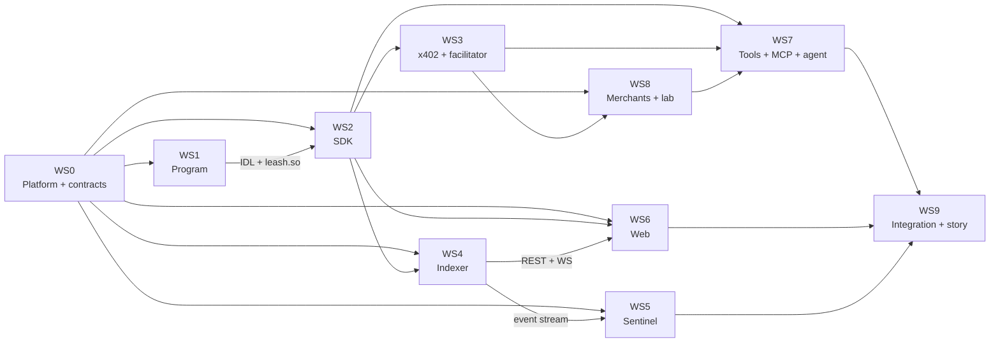

# Workstreams: how the build is split across Claude Code sessions

The system is split along its architecture, not along a timeline. Each workstream owns a set of paths, consumes and provides contracts defined in [docs/architecture/](../architecture/), and can be built to a high standard by one focused Claude Code session. You (Parth) steer each session: it proposes a plan, you approve it, it builds in its lane.

## The ten workstreams

| WS | Name | Owns | Brief |
| --- | --- | --- | --- |
| **WS0** | Platform and shared contracts | root configs, `.github/`, `scripts/`, `packages/contracts/`, `artifacts/programs/subscriptions.so` | [WS0-platform.md](WS0-platform.md) |
| **WS1** | Leash program (Rust / Anchor) | `programs/`, `Anchor.toml`, `Cargo.toml`, `Cargo.lock`, `rust-toolchain.toml`, `artifacts/programs/leash.so`, `packages/contracts/idl/` | [WS1-program.md](WS1-program.md) |
| **WS2** | TypeScript SDK | `packages/sdk/` | [WS2-sdk.md](WS2-sdk.md) |
| **WS3** | x402 layer and facilitator | `packages/x402/`, `services/facilitator/` | [WS3-x402-facilitator.md](WS3-x402-facilitator.md) |
| **WS4** | Indexer and read API | `services/indexer/` | [WS4-indexer.md](WS4-indexer.md) |
| **WS5** | Sentinel and alerts | `services/sentinel/` | [WS5-sentinel.md](WS5-sentinel.md) |
| **WS6** | Web control panel | `apps/web/` | [WS6-web.md](WS6-web.md) |
| **WS7** | Agent tools, MCP server, demo agent | `packages/tools/`, `packages/mcp/`, `apps/agent-demo/` | [WS7-agent-mcp.md](WS7-agent-mcp.md) |
| **WS8** | Demo merchants and adversarial lab | `apps/merchant-demo/` | [WS8-merchant-lab.md](WS8-merchant-lab.md) |
| **WS9** | Integration, end-to-end tests and story | `e2e/`, `scripts/demo/`, `README.md`, `docs/pitch/` | [WS9-integration-story.md](WS9-integration-story.md) |

## Ownership

A session edits **only** the paths its workstream owns, plus its own status file `docs/workstreams/status/WS<N>.md`. Everything else is changed by its owner, or through an ADR:

| Shared path | How it changes |
| --- | --- |
| `packages/contracts/` | WS0 maintains it; anyone may propose a change through the contract-change process ([04-conventions.md §6](../architecture/04-conventions.md#6-changing-a-contract)). `idl/` is written only by WS1. |
| `docs/architecture/`, `CLAUDE.md`, `docs/workstreams/WS*.md` | Only through an ADR, merged by Parth |
| `docs/adr/` | Anyone adds a new file; nobody edits another workstream's ADR |

## Dependencies

Almost everything can start in parallel once WS0 has shipped the monorepo skeleton and `packages/contracts`. These unblockers make that possible:

| Unblocker | Produced by | Lets these start early |
| --- | --- | --- |
| Architecture docs (this folder's siblings) | done | everyone |
| `packages/contracts` types, fixtures, policy test vectors | WS0, build steps 1–3 | WS2, WS4, WS5, WS6, WS8 |
| An **interface-complete IDL** (all instructions, accounts, events and errors; handler bodies may still be stubs) | WS1, build step 1 | WS2 (client generation), WS4 (decoding) |
| Indexer **fixture replay mode** (serves the demo storyline without a chain) | WS4, build step 1 | WS5, WS6 |
| `@leash/sdk/testing` LiteSVM harness | WS2, build step 5 | WS3, WS7, WS9 |

## How many sessions?

Run one session per workstream if you can. With fewer sessions, group them in this order (each arrow means "then"):

| Sessions | Grouping |
| --- | --- |
| 3 | **A (local machine):** WS0 → WS1 → WS9 · **B:** WS2 → WS3 → WS8 → WS7 · **C:** WS6 → WS4 → WS5 |
| 4 | **A (local machine):** WS0 → WS1 · **B:** WS2 → WS3 · **C:** WS6 → WS4 → WS5 · **D:** WS8 → WS7 → WS9 |
| 6 | WS0 + WS1 (local machine) · WS2 · WS3 + WS8 · WS4 + WS5 · WS6 · WS7 → WS9 |

WS1 and anything that deploys to a chain needs a machine with the Solana toolchain, or a cloud environment that allows the Solana hosts ([ADR-0007](../adr/0007-environments-and-artifacts.md)).

## Session protocol

Every session, every time:

1. **Sync:** merge the latest `main` into your branch.
2. **Read:** `CLAUDE.md` → your brief → the documents under "Read first" in your brief → your status file → any ADR newer than your status file.
3. **Plan:** write the plan for the next build step into your status file and show it to Parth. Wait for approval before large changes.
4. **Build:** stay in your lane, tests alongside code, follow [04-conventions.md](../architecture/04-conventions.md).
5. **Close:** update your status file (done, next, open items, questions for other workstreams), commit, push.

## Starting a session

Open a new Claude Code session on this repository and paste the **starter prompt** at the bottom of the workstream's brief. Every brief ends with one.

Status files live in [status/](status/). Each workstream edits only its own.
